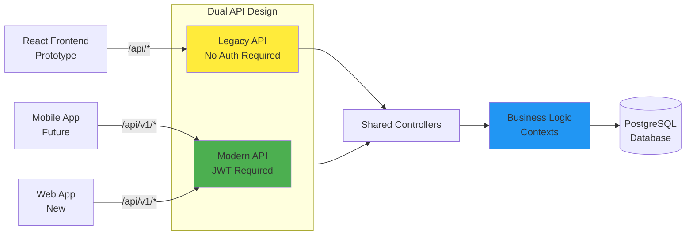
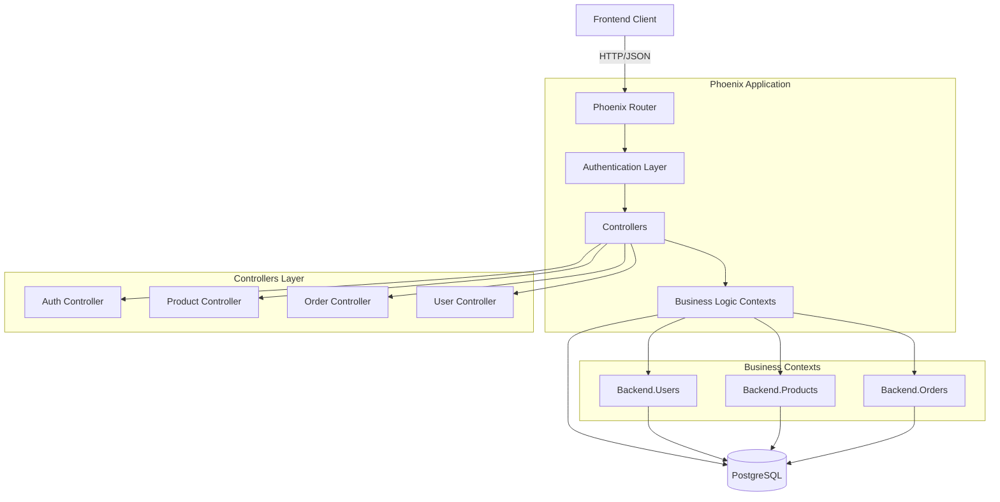
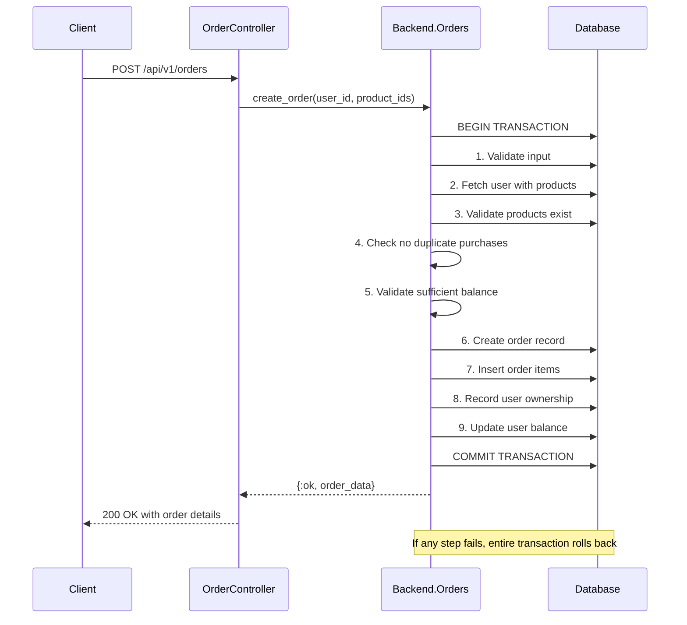
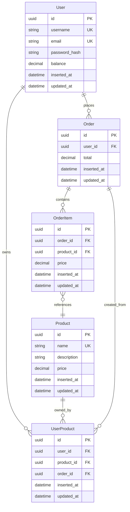

# Benefits Management Backend API

A Phoenix/Elixir backend API for an application providing user register and authentication, product (benefits) fetching, and order (subscription) management capabilities.

## The Challenge

This project started with a simple requirement: build an API for an existing React frontend prototype. However, the prototype had several limitations that made it unsuitable for production:

- **No authentication** - any user could access any data
- **Username-based identification** - insecure and inflexible
- **Limited error handling** - basic success/failure responses
- **Inconsistent data formats** - product names used as IDs
- **REST inconsistency** - GET endpoints used for creating data

Rather than forcing the frontend to change immediately, I designed a **dual API strategy** that supports both worlds.

## The Solution: Prototype Compatibility + Production API

### API Strategy Overview



### Legacy Prototype API (`/api/*`)
Maintains 100% compatibility with the existing frontend:
```http
GET /api/users/john_doe          # No auth required, creates user if missing
GET /api/products                # Returns products with names as IDs  
POST /api/orders                 # Uses product names, not UUIDs
```

### Improved Production API (`/api/v1/*`)
Designed for security, scalability, and best practices:
```http
POST /api/v1/auth/login          # JWT authentication
GET /api/v1/products             # Proper UUID-based identification
POST /api/v1/orders              # Authenticated, atomic transactions
Authorization: Bearer <token>
```

## Core Features

### 🔐 **Dual Authentication Model**
- **Legacy endpoints**: Open access for prototype compatibility
- **V1 endpoints**: JWT-based authentication with bcrypt password hashing
- **User management**: Registration, login, and secure session handling

### 💰 **Robust Order Processing**
- **Atomic transactions**: All-or-nothing order processing using `Ecto.Multi`
- **Balance validation**: Prevents overdrafts
- **Duplicate prevention**: Users can't buy the same product twice
- **Automatic rollback**: Database consistency guaranteed on failures

### 📊 **Smart Data Design**
- **UUID primary keys**: Security and scalability
- **Decimal precision**: Accurate financial calculations
- **Foreign key constraints**: Data integrity at the database level
- **Optimized queries**: Preloading to minimize N+1 problems

## Quick Start

```bash
# Database setup
docker-compose up -d
mix setup

# Start the server
mix phx.server

# Visit http://localhost:4000
```

The API will be available at:
- **Legacy**: `http://localhost:4000/api/*` (for existing frontend)
- **Modern**: `http://localhost:4000/api/v1/*` (for new applications)

## API Examples

### Legacy Frontend Support
```bash
# Get user (creates if doesn't exist)
curl http://localhost:4000/api/users/john_doe

# Place order using product names
curl -X POST http://localhost:4000/api/orders \
  -H "Content-Type: application/json" \
  -d '{"order": {"items": ["netflix", "spotify"], "user_id": "john_doe"}}'
```

### Improved Secure API
```bash
# Register and get JWT token
curl -X POST http://localhost:4000/api/v1/auth/register \
  -H "Content-Type: application/json" \
  -d '{"username": "john_doe", "email": "john@example.com", "password": "SecurePass123!"}'

# Place authenticated order using product ids
curl -X POST http://localhost:4000/api/v1/orders \
  -H "Authorization: Bearer <token>" \
  -H "Content-Type: application/json" \
  -d '{"items": ["550e8400-e29b-41d4-a716-446655440000"]}'
```

## Architecture Highlights

### System Overview



### Transaction Safety
### Order Transaction Flow

The atomic order processing ensures data consistency:



This multi-step transaction ensures that either all operations succeed or none do - preventing partial orders or inconsistent balances.

### Security Layers
- **Password hashing**: bcrypt with secure salts
- **JWT tokens**: Stateless authentication for scalability
- **SQL injection prevention**: Parameterized queries throughout
- **Input validation**: Multiple validation layers (changeset, context, controller)

### Performance Considerations
- **Database connection pooling**: Efficient resource usage
- **Preloaded associations**: Optimized query patterns
- **UUID indexing**: Fast lookups without exposing sequential IDs

## Data Model

The system tracks five main entities with clear relationships:



Key relationships:
- **Users** have a balance and can place multiple orders
- **Orders** contain multiple products and belong to one user
- **Products** have pricing and can appear in multiple orders
- **UserProducts** tracks ownership to prevent duplicate purchases

## Why This Approach?

**Backward Compatibility**: The legacy API keeps existing code working while new features get built on solid foundations.

**Security Evolution**: Authentication can be added progressively without breaking existing integrations.

**Future-Proof**: The v1 API follows REST conventions and can evolve with versioning strategies.

**Migration Path**: Teams can migrate endpoint by endpoint rather than requiring a big-bang rewrite.

## Testing

```bash
mix test              # Run all tests
mix test --coverage   # With coverage report
```

Tests cover both API versions, ensuring legacy compatibility doesn't break as new features are added.

## Environment Configuration

The API adapts to different environments:
- **Development**: Includes seed data and debugging tools
- **Test**: Isolated database with no seed data
- **Production**: Optimized settings and security headers

## Common Error Codes

Both APIs return consistent error formats:

| Code | Description | HTTP Status |
|------|-------------|-------------|
| `products_not_found` | One or more products don't exist | 400 |
| `products_already_purchased` | User already owns these products | 400 |
| `insufficient_balance` | Not enough funds for purchase | 400 |
| `invalid_credentials` | Login failed | 401 |
| `unauthenticated` | JWT token required | 401 |

## Requirements

- **Elixir** 1.15+
- **Erlang/OTP** 26+
- **PostgreSQL** 13+
- **Docker** (for local development)

## Project Structure

```
lib/
├── backend/           # Business logic contexts
│   ├── users.ex      # User management
│   ├── products.ex   # Product catalog  
│   └── orders.ex     # Order processing
├── backend_web/       # Web layer
│   ├── controllers/  # API endpoints
│   └── router.ex     # Route definitions
└── backend_web.ex    # Web configuration
```

The codebase separates business logic (contexts) from web concerns (controllers), making it easy to add new interfaces or change API formats without affecting core functionality.