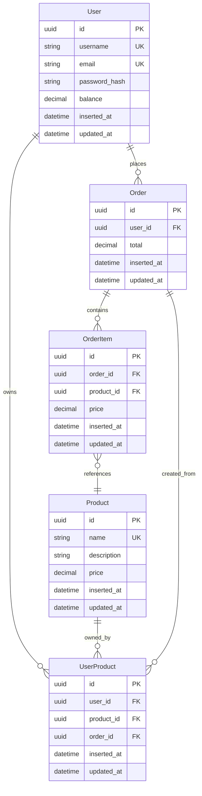
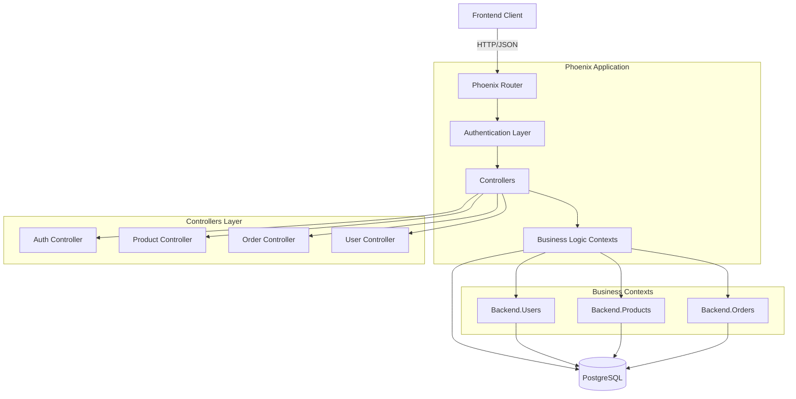
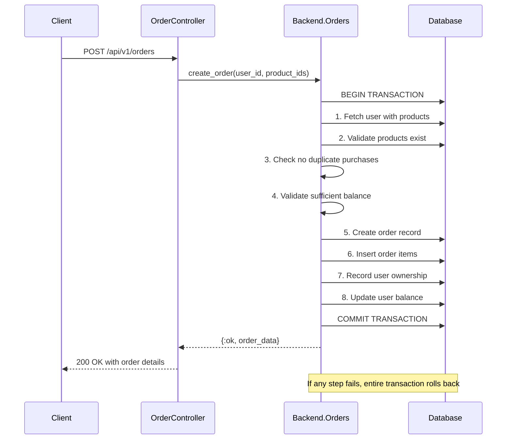

# Benefits Management Backend API

A Phoenix/Elixir backend API for an application providing user register and authentication, product (benefits) fetching, and order (subscription) management capabilities.

## System Design

### Functional Requirements

The system should support the following core functionalities:

1. **User Management**
   - User registration with email and password validation
   - User authentication with JWT tokens
   - User balance management with default starting balance

2. **Product Management** 
   - Product catalog with unique identifiers and pricing
   - Product lookup by ID

3. **Order Processing**
   - Authenticated order creation with balance validation
   - Duplicate purchase prevention (one product per user)
   - Atomic transaction processing with automatic rollback
   - Order history and item tracking

4. **Legacy Support**
   - Backward compatibility with the prototype frontend
     - no authentication required
     - create user on get when not found
     - users are indexed and fetched by username
     - preserve initial requirements responses
     - support for legacy product identification by name


### Non-Functional Requirements

1. **Security**
   - JWT-based authentication for sensitive operations
   - Password hashing using bcrypt with secure salts
   - SQL injection prevention via parameterized queries
   - User authorization (users can only access own data)

2. **Data Integrity**
   - ACID transactions for order processing
   - UUID-based primary keys for security
   - Comprehensive input validation at all layers
   - Referential integrity via foreign key constraints

3. **Performance & Scalability**
   - Database connection pooling
   - Efficient query patterns with preloading
   - Stateless authentication for horizontal scaling

4. **Reliability**
   - All-or-nothing order processing
   - Database transaction rollback on failures
   - Comprehensive error handling and logging

### Key Assumptions

1. **Business Logic**
   - Single currency (EUR) with 2 decimal precision
   - One-time purchases only
   - Static product catalog (no dynamic creation supported)
   - Default user balance of 1000.00 virtual currency

2. **Technical**
   - PostgreSQL as primary database
   - Development environment uses Docker
   - Single JWT secret (production should use key rotation)
   - No user roles/permissions beyond basic authentication

## Data Model



## API Overview

### Prototype Endpoints (Frontend Support)

> ⚠️ These endpoints are maintained for frontend compatibility but have security and convention limitations.

#### Get Products (Legacy)
```http
GET /api/products
```

**Response:**
```json
{
  "products": [
    {
      "id": "netflix",
      "name": "Netflix Subscription", 
      "price": "75.99"
    }
  ]
}
```

#### Get User by Username (Legacy)
```http
GET /api/users/{username}
```

**Response:**
```json
{
  "user": {
    "user_id": "john_doe",
    "data": {
      "balance": "1000.00",
      "product_ids": ["netflix", "spotify"]
    }
  }
}
```

#### Create Order (Legacy)
```http
POST /api/orders
Content-Type: application/json

{
  "order": {
    "items": ["netflix", "spotify"],
    "user_id": "username_here"
  }
}
```

**Response:**
```json
{
  "order": {
    "order_id": "456e7890-e12b-34c5-d678-901234567890",
    "data": {
      "items": [
        {
          "id": "netflix",
          "name": "Netflix Subscription",
          "price": "75.99"
        }
      ],
      "total": "75.99"
    }
  }
}
```

### Upgraded API Endpoints (V1)

> **URL Versioning**: All upgraded endpoints use `/api/v1/` prefix

#### Authentication

**Register User**
```http
POST /api/v1/auth/register
Content-Type: application/json

{
  "username": "john_doe",
  "email": "john@example.com", 
  "password": "SecurePass123!"
}
```

**Response:**
```json
{
  "username": "john_doe",
  "email": "john@example.com",
  "token": "eyJhbGciOiJIUzI1NiIs..."
}
```

**Login User**
```http
POST /api/v1/auth/login
Content-Type: application/json

{
  "username": "john_doe",
  "password": "SecurePass123!"
}
```

**Response:**
```json
{
  "username": "john_doe",
  "balance": "1000.00",
  "email": "john@example.com",
  "product_ids": ["550e8400-e29b-41d4-a716-446655440000"],
  "token": "eyJhbGciOiJIUzI1NiIs..."
}
```

#### Products

**List Products**
```http
GET /api/v1/products
```

**Response:**
```json
[
  {
    "id": "550e8400-e29b-41d4-a716-446655440000",
    "name": "netflix",
    "description": "Netflix Subscription", 
    "price": "75.99"
  }
]
```

#### Orders

**Create Order**
```http
POST /api/v1/orders
Authorization: Bearer <token>
Content-Type: application/json

{
  "items": ["550e8400-e29b-41d4-a716-446655440000"]
}
```

**Response:**
```json
{
  "id": "456e7890-e12b-34c5-d678-901234567890",
  "items": [
    {
      "id": "550e8400-e29b-41d4-a716-446655440000",
      "name": "netflix",
      "description": "Netflix Subscription",
      "price": "75.99"
    }
  ],
  "total": "75.99",
  "created_at": "2023-12-01T10:30:00Z"
}
```

## System Architecture



## Transaction Flow



## Prerequisites

- Elixir 1.15+
- Erlang/OTP 26+
- PostgreSQL 13+
- Docker & Docker Compose (for database)

## Development Setup

1. **Start PostgreSQL database:**
   ```bash
   docker-compose up -d
   ```

2. **Install dependencies and setup database:**
   ```bash
   mix setup
   ```

3. **Start Phoenix server:**
   ```bash
   mix phx.server
   ```

4. **Access the application:**
   - API: [`localhost:4000`](http://localhost:4000)
   - Phoenix LiveDashboard (dev only): [`localhost:4000/dev/dashboard`](http://localhost:4000/dev/dashboard)

## Testing

```bash
# Run all tests
mix test
```

## API Versioning Strategy

This API uses **URL-based versioning** to maintain backward compatibility:

- **Legacy endpoints**: Use `/api/` prefix (for existing frontend compatibility)
- **Upgraded endpoints**: Use `/api/v1/` prefix

**Routing Logic:**
1. Requests to `/api/v1/` → Routes to upgraded endpoints with enhanced features
2. Requests to `/api/` → Routes to legacy endpoints (prototype compatibility)
3. Clear URL separation prevents routing conflicts

## API Conventions

### Response Format
- Upgraded endpoints return flat structures: `{"id": "...", "username": "..."}`
- Legacy endpoints preserve prototype format with wrappers

### Authentication
- Protected endpoints require: `Authorization: Bearer <token>`
- Unauthenticated requests return 401 with error details

### Error Handling
```json
{
  "error": "error_code",
  "message": "Human readable message"
}
```

Common error codes:
- `products_not_found`
- `products_already_purchased` 
- `insufficient_balance`
- `unauthenticated`
- `registration_failed`

### Monetary Values
All monetary values are strings for precision: `"1000.00"`, `"75.99"`

### Identifiers
- Upgraded API uses UUIDs when needed
- Legacy API uses username and product names
- Client should treat all IDs as opaque strings