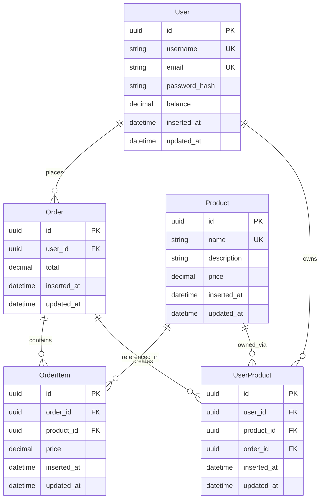

# Benefits Management Backend API

A Phoenix/Elixir backend API for an application providing user register and authentication, product (benefits) fetching, and order (benefit purchases) management capabilities. It could be iterated upon further.

## The Challenge

The challenge required building an API for an existing React frontend prototype with these specifications:

**Requirements:**
- Retrieve data from a single user (indexed by username)
- Retrieve a collection of products (with unique ID, price, name)
- Place orders with balance validation and duplicate purchase prevention
- Support these endpoints:
  - `GET /api/users/:user_id` - Returns/creates user
  - `GET /api/products` - Returns product list
  - `POST /api/orders` - Creates orders

**Limitations:**
- **No authentication** - any user could access any data
- **Username-based identification** - insecure and inflexible
- **Limited error handling** - basic success/failure responses
- **Inconsistent data formats** - product names used as IDs
- **REST inconsistency** - GET endpoints used for creating data

## Upgraded API Version

This API addresses the limitations while still maintaining backwards compatibility for the Frontend prototype.

### API Overview


### Frontend Prototype API (`/api/*`)
```
GET /api/users/john_doe          # No auth required, creates user if missing
GET /api/products                # Returns products with names as IDs  
POST /api/orders                 # Uses product names, not UUIDs
```

### New Endpoints (`/api/v1/*`)
```
POST /api/v1/auth/register       # User registration
POST /api/v1/auth/login          # JWT authentication
GET /api/v1/products             # UUID-based products
GET /api/v1/users/me             # User fetching
POST /api/v1/orders              # Authenticated orders
```

## Data Model

### Entities
- **User**: Account with balance and authentication credentials
- **Product**: Benefit with pricing (Netflix, Spotify, etc.)
- **Order**: Purchase transaction with total amount
- **OrderItem**: Individual item within an order
- **UserProduct**: Ownership product tracking



## Development Setup

### Requirements
- **Elixir** 1.15+
- **Erlang/OTP** 26+
- **PostgreSQL** 13+
- **Docker** (for development)

### Running the Application
```bash
cd backend

# Database setup (PostgreSQL via Docker)
docker-compose up -d

# Install dependencies and setup database with migrations and seeds
mix setup

# Start Phoenix server
mix phx.server
```

The API will be available at:
- **Legacy**: `http://localhost:4000/api/*` (for existing frontend)
- **Enhanced**: `http://localhost:4000/api/v1/*` (for new applications)

### Testing
```bash
# Run all tests
mix test
```

### HTTP File Testing
For manual API testing, use the provided HTTP file `api_test.http`:

```bash
# 1. User registration
# 2. User login  
# 3. Product listing
# 4. User profile fetching
# 5. Order creation
# 6. Token refresh
# 7. User logout
```

## Key Assumptions

**Business Logic**
- Single currency (EUR) with 2 decimal precision for financial accuracy
- One-time purchases only - users can't buy the same product twice
- Static product catalog - products are seeded, not dynamically created yet
- Default user balance of €1000.00 virtual currency for new accounts

**Legacy Compatibility**
- Support existing React frontend:
    - Username-based user identification
    - Product names (like "netflix") used as identifiers
    - No breaking changes to existing endpoint contracts

## Core Features

- **Authentication**: Prototype (open access) + V1 API (JWT with bcrypt)
- **Atomic Transactions**: All-or-nothing order processing with automatic rollback
- **Balance & Ownership Validation**: Prevents overdrafts and duplicate purchases
- **UUID Keys & Decimal Precision**: Security and accurate financial calculations

## Transaction Safety

The atomic order processing uses `Ecto.Multi` to ensure data consistency:


This multi-step transaction ensures that either all operations succeed or none do - preventing partial orders or inconsistent balances.

